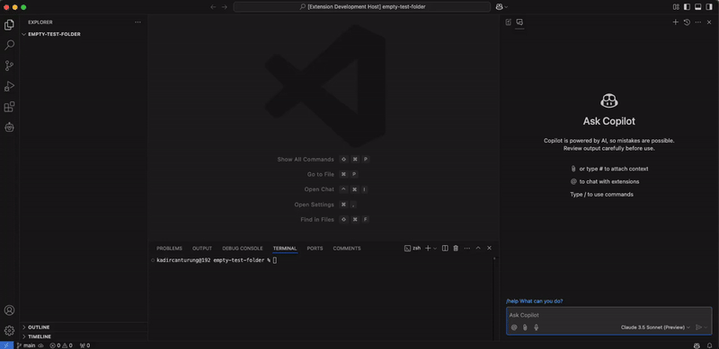

# 🚀 Cogent: Your Agentic AI-Powered Coding Companion

> "Because rubber duck debugging is better with a duck that talks back!"



Cogent is an agentic Github Copilot VSCode chat extension that transforms your coding environment into an autonomous development powerhouse. Think of it as having a brilliant (and slightly nerdy) AI agent who not only understands your code but can independently take actions while keeping you in control. It's your witty companion that makes coding feel like pair programming with a super-smart friend who never needs coffee breaks!

## 🎯 Prerequisites

Before we embark on this magical journey, make sure you have:

- 💳 Active GitHub Copilot subscription
- 📦 VS Code 1.95.0 or higher
- 🤖 GitHub Copilot Chat extension

## ✨ Features

- 🤖 **Autonomous Agent** - Works independently with minimal supervision
- 📝 **Smart File Operations** - Create, read, and update files with AI precision
- 🎮 **Command Execution** - Run terminal commands without leaving your chat
- 🧠 **Context-Aware** - Understands your entire project structure
- 🤝 **Pair Programming** - Like pair programming, but your partner never needs coffee breaks
- 🔒 **Safe Operations** - Asks for your approval before making changes or running commands
- 📚 **Workspace Awareness** - Can load your entire workspace for better context (configurable)
- 📜 **Custom Rules** - Teach your AI companion your project's special needs
- 🔍 **Symbol Search** - Find symbols in the code base and return relevant code snippets with line numbers
- 🔍 **File Search** - Search for files by partial filename matching and return relevant file paths
- 🔍 **Text Search** - Search for exact text matches in workspace files

## 🚀 Installation

### For Development

1. Clone the repository
2. Install dependencies:
   ```bash
   npm install
   ```
3. Compile the extension:
   ```bash
   npm run compile
   ```
4. Press F5 in VS Code to start debugging
   > This will open a new VS Code window with the extension loaded

### Distribution

Want to package the extension for distribution? Easy peasy:

1. Install vsce globally:
   ```bash
   npm install -g @vscode/vsce
   ```
2. Package the extension:
   ```bash
   vsce package
   ```
   This creates a `.vsix` file you can distribute!

## ⚙️ Configuration

### Workspace Awareness

Cogent can be as nosy or respectful as you want with your workspace:

```json
{
    "cogent.use_full_workspace": true  // Default: false
}
```

- When `true`: Cogent loads your entire workspace upfront. Respects your .gitignore file
- When `false`: Reads files on-demand

> 💡 Tip: Disable for large workspaces unless you want Cogent to have a coffee break while loading!

### Custom Rules

Want Cogent to follow your house rules? Create a `.cogent/rules.md` file in your workspace root:

```plaintext
# Example .cogentrules
1. Always use TypeScript strict mode
2. Follow Angular style guide
3. No console.log(), use proper logging service
```

Think of it as leaving a note for your AI roommate about how to keep the code clean! 🧹

## 🎮 Usage

1. Open GitHub Copilot Chat in VS Code
2. Type `@cogent` followed by your request
3. Watch your agentic buddy spring into action!

Cogent works autonomously but always asks for your approval when:
- Creating or modifying files in your workspace
- Running terminal commands
- Making significant project changes

This ensures you stay in control while letting Cogent handle the heavy lifting!

### Commands

1. `@cogent /codeReviewStaging` - Generates a unified diff from the staged files in GIT and code reviews it.
2. `@cogent /codeReviewBranch [branch]` - Generates a unified diff between your HEAD and branch specified (default: master) and code reviews it.

### 🗂️ Plan and Execute Plan Commands

Cogent now supports planning and executing tasks using the `/plan` and `/executePlan` commands.

#### Plan Command

The `/plan` command modifies the prompt given to the LLM to tell it to plan the task and generate a `.cogent/plan.md` file in the workspace directory. The `plan.md` file contains the task description and all the files and changes it needs to make to each file as part of the plan.

Example `plan.md` file:

```md
# Task
Description of task

# Files
path/filename1.ext
* First objective
* Second objective

path/filename2.ext
* First objective
* Second objective
* Third objective
```

#### Execute Plan Command

The `/executePlan` command reads the `plan.md` file and executes the tasks laid out there.

To use these commands, simply type `@cogent /plan` to create a plan and `@cogent /executePlan` to execute the plan.


## 💬 Example Conversations

```
You: "@Cogent Can you help me refactor this function?"
Cogent: "I'll analyze your code and suggest some improvements. Here's my plan..."
```

```
You: "@Cogent Create a new React component for user authentication"
Cogent: "I'll help you create a secure authentication component. First, let me outline the structure..."
```

## 🎭 Behind the Scenes

Cogent is powered by the GitHub Copilot and mighty Claude-3.5-Sonnet model. It's like having a tiny developer living in your VS Code. Don't worry, we feed them virtual cookies! 🍪

## 🤝 Contributing

Found a bug? Want to make Cogent even more awesome? We love contributions! Just:

1. Fork it (like a pro)
2. Create your feature branch (`git checkout -b feature/amazing-feature`)
3. Commit your changes (`git commit -m 'Add some amazingness'`)
4. Push to the branch (`git push origin feature/amazing-feature`)
5. Open a PR and do a little victory dance 💃

## 🐛 Bug Reports

If something's not working quite right:

1. Open an issue
2. Tell us what went wrong (the more details, the better!)
3. Show us how to reproduce it
4. Cross your fingers and wait for the fix

## 📜 License

MIT - Because sharing is caring! Feel free to use this in your projects, but remember to give a virtual high-five back! 🖐️

---

Made with ❤️ and lots of ☕ by awesome developers like you!

*Remember: The best code is the one that works... but the second-best is not writing any code at all!* 😉
